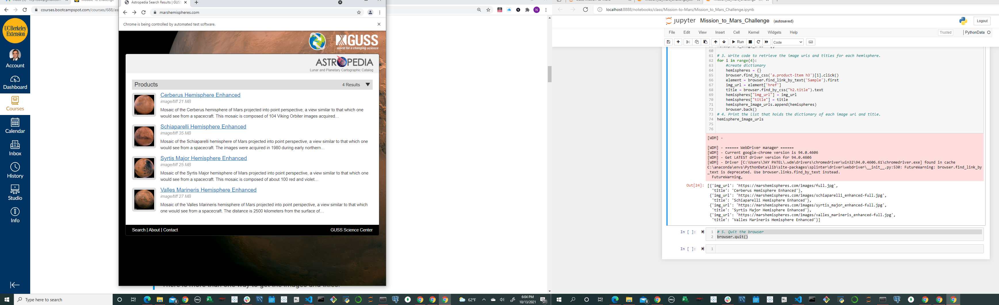
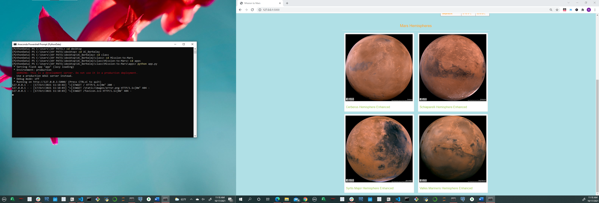
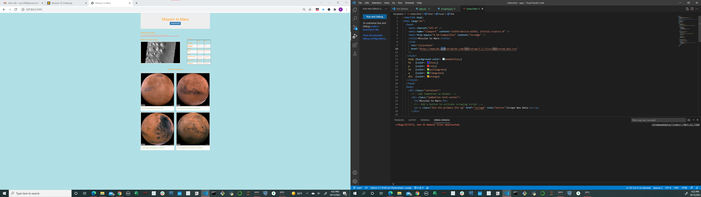
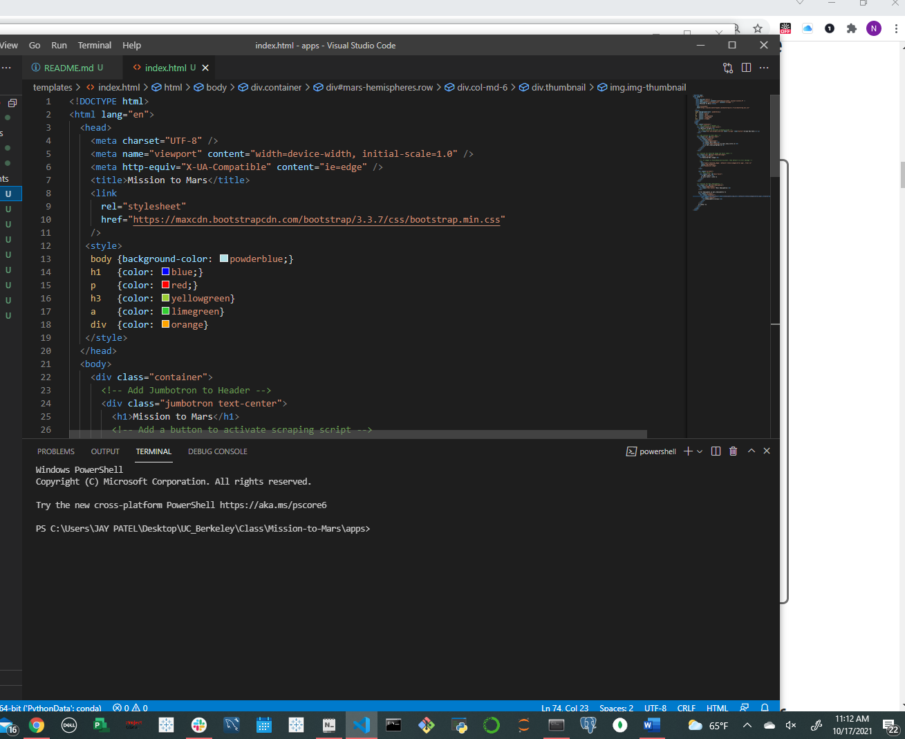

## Project Name: Mission-to-Mars

## Project manager: Nayan patel

## Project Overview:

Creating a web app to include all four of the hemisphere images using BeautifulSoup and Splinter

Scraping full-resolution images of Mars’s hemispheres and the titles of those images.

Storing the scraped data on a Mongo database, use a web application to display the data, and alter the design of the web app to accommodate these images.

## Tools used: Jupyter notebook, VS code, Flask, BeautifulSoup, Splinter, HTML, MondoDB.

## Deliverables:

Deliverable 1: Scrape Full-Resolution Mars Hemisphere Images and Titles

Deliverable 2: Update the Web App with Mars Hemisphere Images and Titles

Deliverable 3: Add Bootstrap 3 Components

## Results:

Deliverable 1:

Deliverable 2:

Deliverable 3:

